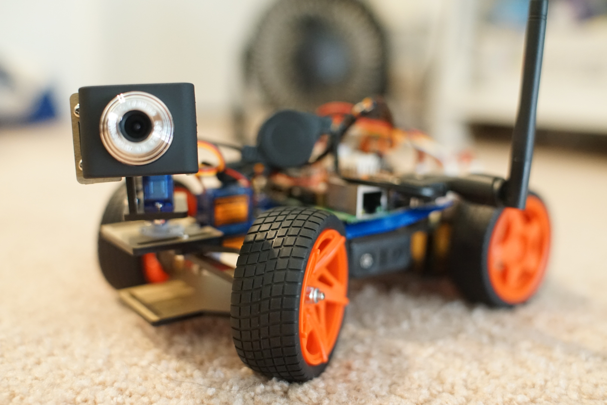
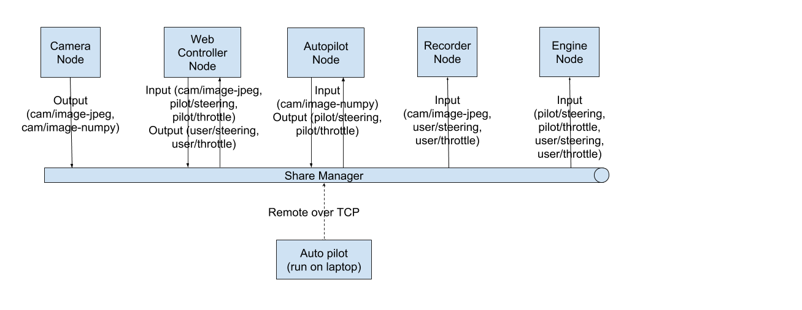

# autoRC
Street is danger, why not making autonomous toy?

Autonomous Remote Controlled (toy) car using deep learning. Raspberry Pi, PiCar, Python

You can find hardware on [here](https://www.sunfounder.com/free/p1429u49266), I'm too lazy to build from scratch.

## Design
Inspired by Robot Operating System ([ROS](http://www.ros.org/)) each components is a Node and run in it own process. A Node can be sensors, controller, motion planner, camera, Deep Learning pilot... which talk to each other via pub/sub like system.

Current implementation using Python's built in multiprocessing manager that allow sharing objects, data between Processes. Pros: Utilize CPU cores, avoid PIL, run nodes over network from different machine. Cons: Data are being pickle/unpickle multiple time and send over network which is slower than thread. May consider using more decend message queue like Redis.
